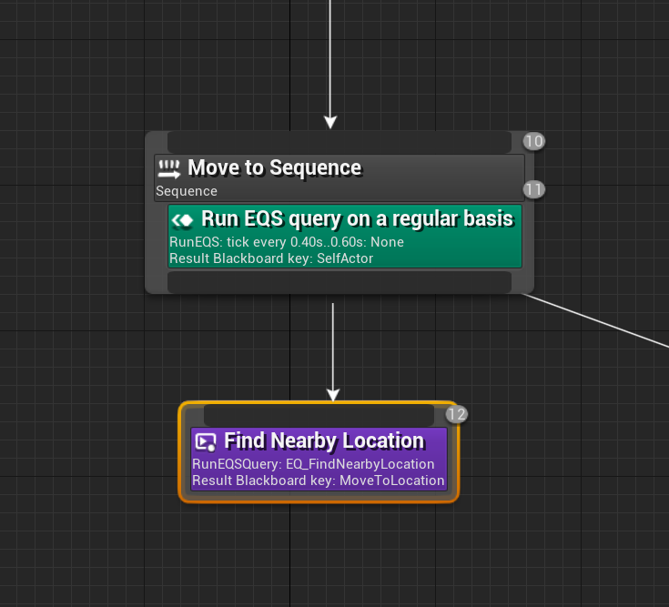
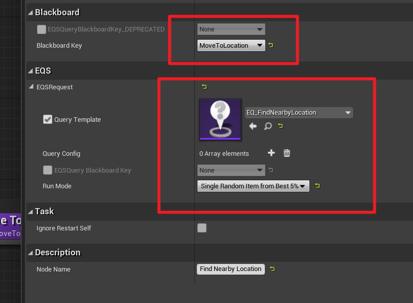
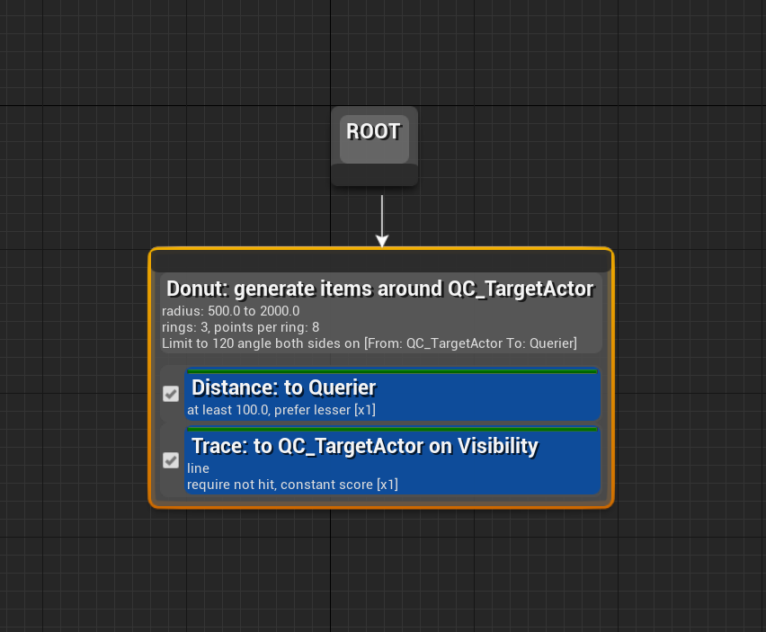
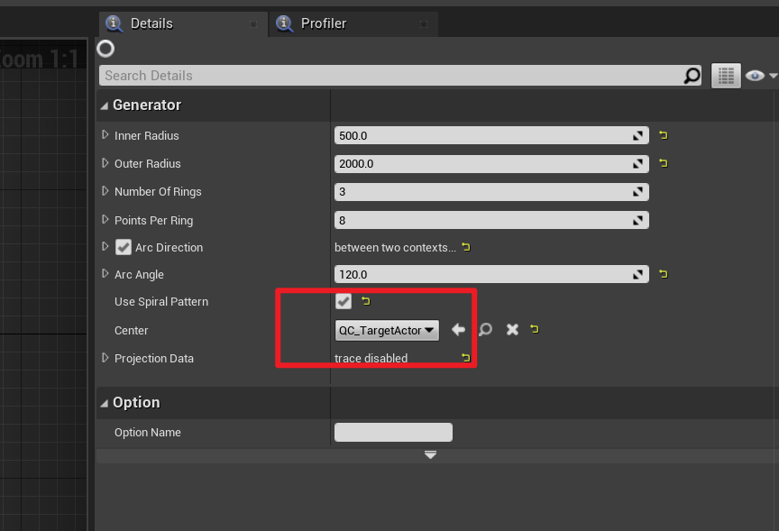
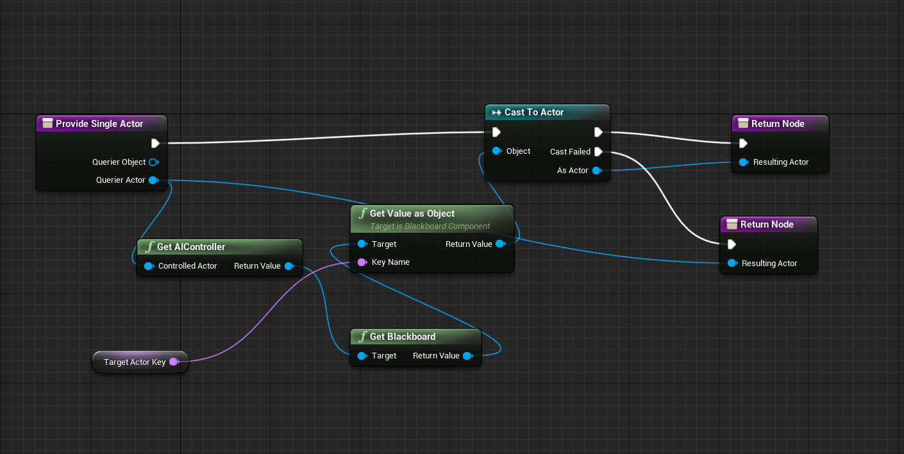

# AI

## 1. AICharacter

```C++
UCLASS()
class ACTIONROGUELIKE_API AYSAICharacter : public ACharacter
{
    GENERATED_BODY()

public:
    AYSAICharacter();

    virtual void PostInitializeComponents() override;
protected:

    // UI 设置,可以不在初始时添加 UI,比如在有仇恨的时候才亮血条
    UPROPERTY()
    UYSWorldUserWidget* HealthBarWidget;
    UPROPERTY(EditDefaultsOnly, Category="Widgets")
    TSubclassOf<UYSWorldUserWidget> HealthBarWidgetClass;

    // 感知功能(视觉听觉等)
    UPROPERTY(VisibleAnywhere, Category="Components")
    UPawnSensingComponent* PawnSensingComponent;

    // 属性管理,可以替换为 ASC等
    UPROPERTY(VisibleAnywhere, Category="Components")
    UYSAttributeComponent* AttributeComponent;

    // 反应函数
    UFUNCTION()
    void OnPawnSeen(APawn* Pawn);

    UFUNCTION()
    void OnHealthChanged(AActor* InstigatorActor, UYSAttributeComponent* OwningComponent, float NewHealth, float Delta);

    bool TargetPlayerSet;
};

AYSAICharacter::AYSAICharacter()
{
    PawnSensingComponent = CreateDefaultSubobject<UPawnSensingComponent>("SensingComponent");
    TargetPlayerSet = false;

    // 检测属性变化
    AttributeComponent = CreateDefaultSubobject<UYSAttributeComponent>("AttributeComponent");
    AttributeComponent->OnHealthChanged.AddDynamic(this, &ThisClass::OnHealthChanged);
}

void AYSAICharacter::PostInitializeComponents()
{
    Super::PostInitializeComponents();
    // 添加感知回调
    PawnSensingComponent->OnSeePawn.AddDynamic(this, &AYSAICharacter::OnPawnSeen);
}

void AYSAICharacter::OnPawnSeen(APawn* Pawn)
{
    if (TargetPlayerSet)
    {
        return;
    }

    // 获取仇恨
    AAIController* AIC = Cast<AAIController>(GetController());
    if (AIC)
    {
        UBlackboardComponent* BlackboardComponent = AIC->GetBlackboardComponent();
        BlackboardComponent->SetValueAsObject("TargetActor", Pawn);

        TargetPlayerSet = true;
    }
}

void AYSAICharacter::OnHealthChanged(AActor* InstigatorActor, UYSAttributeComponent* OwningComponent, float NewHealth,
                                     float Delta)
{
    // 亮血条
    if (HealthBarWidget == nullptr)
    {
        HealthBarWidget = CreateWidget<UYSWorldUserWidget>(GetWorld(), HealthBarWidgetClass);
        if (HealthBarWidget)
        {
            HealthBarWidget->AttachedActor = this;
            HealthBarWidget->AddToViewport();
        }
    }
}
```

## 2. AIController

AIController 主要作用是开启行为树

```C++
{
    // ...
    UPROPERTY(EditDefaultsOnly, Category="AI")
    UBehaviorTree* BehaviorTree;
    // ...
}


if (ensureMsgf(BehaviorTree, TEXT("Behavior Tree is nullptr, please assign HehaviorTree  in you AI controller.")))
{
    RunBehaviorTree(BehaviorTree);
}
```

## 3. BTTask

行为树任务(节点),重载 ExecuteTask 函数即可

```C++
UCLASS()
class ACTIONROGUELIKE_API UYSBTTaskNode_RangedAttack : public UBTTaskNode
{
    GENERATED_BODY()

protected:
    UPROPERTY(EditAnywhere, Category="AI ")
    TSubclassOf<AActor> ProjectileClass;

public:
    virtual EBTNodeResult::Type ExecuteTask(UBehaviorTreeComponent& OwnerComp, uint8* NodeMemory) override;
};


EBTNodeResult::Type UYSBTTaskNode_RangedAttack::ExecuteTask(UBehaviorTreeComponent& OwnerComp, uint8* NodeMemory)
{
    AAIController* AIController = OwnerComp.GetAIOwner();

    if (ensure(AIController))
    {
        ACharacter* AICharacter = Cast<ACharacter>(AIController->GetPawn());
        if (AICharacter == nullptr)
        {
            return EBTNodeResult::Failed;
        }

        // 发射子弹
        FVector MuzzleLocation = AICharacter->GetMesh()->GetSocketLocation("Muzzle_Front");

        AActor* TargetActor = Cast<AActor>(OwnerComp.GetBlackboardComponent()->GetValueAsObject("TargetActor"));
        if (TargetActor == nullptr)
        {
            return EBTNodeResult::Failed;
        }

        FVector Direction = TargetActor->GetActorLocation() - MuzzleLocation;
        FRotator MuzzleRotation = Direction.Rotation();

        FActorSpawnParameters Params;
        Params.SpawnCollisionHandlingOverride = ESpawnActorCollisionHandlingMethod::AlwaysSpawn;

        AActor* NewProjectile = GetWorld()->SpawnActor<AActor>(ProjectileClass, MuzzleLocation, MuzzleRotation, Params);

        return NewProjectile ? EBTNodeResult::Succeeded : EBTNodeResult::Failed;
    }

    return EBTNodeResult::Failed;
}
```

## 4. UBTService

重载 TickNode,作为后台任务

```C++
UCLASS()
class ACTIONROGUELIKE_API UYSBTService_CheckAttackRange : public UBTService
{
    GENERATED_BODY()

protected:
    UPROPERTY(EditAnywhere, Category="AI")
    FBlackboardKeySelector WithInAttackRangeKey;

    virtual void TickNode(UBehaviorTreeComponent& OwnerComp, uint8* NodeMemory, float DeltaSeconds) override;
};


void UYSBTService_CheckAttackRange::TickNode(UBehaviorTreeComponent& OwnerComp, uint8* NodeMemory, float DeltaSeconds)
{
    Super::TickNode(OwnerComp, NodeMemory, DeltaSeconds);

    // 获取需要的资源并进行检查
    UBlackboardComponent* BlackboardComponent = OwnerComp.GetBlackboardComponent();
    if (ensure(BlackboardComponent))
    {
        AActor* TargetActor = Cast<AActor>(BlackboardComponent->GetValueAsObject("TargetActor"));
        if (TargetActor)
        {
            AAIController* AIController = OwnerComp.GetAIOwner();
            if (ensure(AIController))
            {
                APawn* AIPawn = AIController->GetPawn();
                if (ensure(AIPawn))
                {

                    // 检查自己与目标的距离
                    float Distance = FVector::Distance(TargetActor->GetActorLocation(), AIPawn->GetActorLocation());
                    bool WithInAttackRange = Distance < 2000.0f;

                    if (WithInAttackRange)
                    {
                        // 视线检测(检测目标是否在视野中)
                        bool IsInSight = AIController->LineOfSightTo(TargetActor);
                        BlackboardComponent->SetValueAsBool(WithInAttackRangeKey.SelectedKeyName, IsInSight);
                    }
                    else
                    {
                        BlackboardComponent->SetValueAsBool(WithInAttackRangeKey.SelectedKeyName, false);
                    }
                }
            }
        }
    }
}
```

## 5. EQS

Environment Querry Service(EQS),可以作为 Service 使用,也可以作为 Task 使用



使用时指定一个 EQS 的模板和存储结果的值(BlackBoard 中的 Key)



在 EQS 模板中指定一系列评价指标(距离远近,是否可以被看到等)



直接设定采样点分布,通过 EnvironmentQueryContext 指定查询的中心



在 EQC 中计算查询目标(中心)



## 6. Spawn AI Bot

执行 EQS,并绑定完成事件,结束时生成 AI

```C++
void AYSGameModeBase::SpawnBotTimerElapsed()
{
    // 控制台变量控制是否生成 AI
    if (!CVarSpawnBots.GetValueOnGameThread())
    {
        return;
    }

    UEnvQueryInstanceBlueprintWrapper* EnvQueryInstanceBlueprintWrapper = UEnvQueryManager::RunEQSQuery(
        this, SpawnBotQuery, this, EEnvQueryRunMode::RandomBest5Pct, nullptr);

    if (ensure(EnvQueryInstanceBlueprintWrapper))
    {
        EnvQueryInstanceBlueprintWrapper->GetOnQueryFinishedEvent().AddDynamic(this, &ThisClass::OnQueryCompleted);
    }
}
```

```C++
void AYSGameModeBase::OnQueryCompleted(UEnvQueryInstanceBlueprintWrapper* QueryInstance,
                                       EEnvQueryStatus::Type QueryStatus)
{
    if (QueryStatus != EEnvQueryStatus::Success)
    {
        UE_LOG(LogTemp, Warning, TEXT("Spawn bot EQS Query failed!"));
        return;
    }

    // 统计 AI 数量并限制
    int32 NrOfAliveBot = 0;
    for (TActorIterator<AYSAICharacter> It(GetWorld()); It; ++It)
    {
        AYSAICharacter* Bot = *It;
        UYSAttributeComponent* AttributeComponent = Cast<UYSAttributeComponent>(
            Bot->GetComponentByClass((UYSAttributeComponent::StaticClass())));
        NrOfAliveBot++;
    }
    if (NrOfAliveBot > 3)
    {
        return;
    }

    // 可以使用曲线等资产控制
    // DifficultyCurve->GetFloatValue(GetWorld()->TimeSeconds);

    // 生成 AI
    TArray<FVector> Locations = QueryInstance->GetResultsAsLocations();
    if (Locations.IsValidIndex(0))
    {
        GetWorld()->SpawnActor<AActor>(BotSpawnClass, Locations[0], FRotator::ZeroRotator);
    }
}

```
