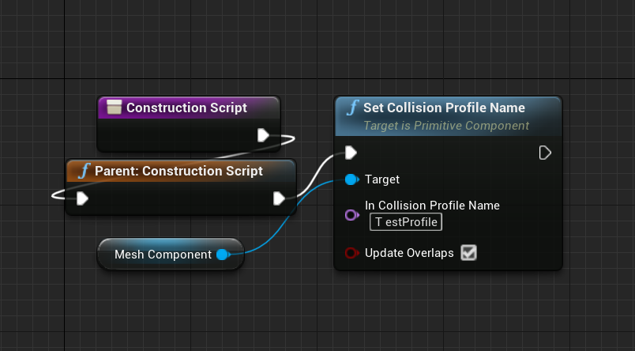

# Collision

## 1. 概述

- Collision 结果
  - Block: 双方都设置对方为 block
  - Overlap: 设置对方为 Block 或者 Overlap,且双方碰撞结果不是 Block
- Collision 事件
  - 碰撞事件: `Simulation Generates Hit Events` 控制
    - `ReceiveHit`,`OnComponentHit`
  - 重叠事件: `Generate Overlap Events` 控制
    - `OnBeginOverlap`
    - `OnEndOverlap`
    - ...
- Collision Type:
  - Spatial query: raycast, sweep, overlap
  - simulation: rigidbody, constraints
- Collision Enabled
  - No Collision: 忽略所有碰撞
  - Query Only: 执行 `Spatial Query`
  - Physics Only: 执行 `Simulation`
  - Collision Enabled: `Spatial Query` 和 `Simulation`

## 2. 碰撞预设

可以在项目设置中新键和调整 Collision Profile,Object Channel

- 在代码中使用

  ```C++
  ATestActor::ATestActor()
  {
      PrimaryActorTick.bCanEverTick = true;

      MeshComponent = CreateDefaultSubobject<UStaticMeshComponent>(TEXT("MeshComponent"));
      RootComponent = MeshComponent;
      MeshComponent->SetCollisionProfileName(FName("TestProfile"));
      // MeshComponent->SetCollisionEnabled(ECollisionEnabled::QueryAndPhysics);
      // MeshComponent->SetCollisionObjectType(ECollisionChannel::ECC_Pawn);
  }
  ```

- 在蓝图中使用

  

## 3. Collision Trace

- LineTrace(同系列的还有 LineTraceTest 等)

  ```C++
  // 碰撞参数
  FCollisionObjectQueryParams ObjectQueryParams;
  ObjectQueryParams.AddObjectTypesToQuery(ECC_WorldDynamic);

  // 获取玩家眼睛位置
  AActor* Owner = GetOwner();
  FVector EyeLocation;
  FRotator EyeRotation;
  Owner->GetActorEyesViewPoint(EyeLocation, EyeRotation);

  // 获取视线位置
  FVector Start = EyeLocation;
  FVector End = EyeLocation + (EyeRotation.Vector() * 1000);

  // Query
  FHitResult Hit;
  bool bBlockingHit = GetWorld()->LineTraceSingleByObjectType(Hit, Start, End, ObjectQueryParams);
  ```

- SweepTrace(同系列的还有 SweepSingleByObjectType 等)

  ```C++
  // 碰撞参数
  FCollisionObjectQueryParams ObjectQueryParams;
  ObjectQueryParams.AddObjectTypesToQuery(ECC_WorldDynamic);

  // 获取玩家眼睛位置
  AActor* Owner = GetOwner();
  FVector EyeLocation;
  FRotator EyeRotation;
  Owner->GetActorEyesViewPoint(EyeLocation, EyeRotation);

  // 获取视线位置
  FVector Start = EyeLocation;
  FVector End = EyeLocation + (EyeRotation.Vector() * 1000);

  // 设置碰撞的球体
  float Radius = 30.0f;
  FCollisionShape Shape;
  Shape.SetSphere(Radius);

  TArray<FHitResult> Hits;
  bool bBlockingHit = GetWorld()->SweepMultiByObjectType(Hits, Start, End, FQuat::Identity, ObjectQueryParams, Shape);
  ```

- Overlap 系列略(如 OverlapMultiByChannel)
