# Data

## 1. DataTable

DataTable: 表格数据  
CompositeDataTable: 表格栈,以最后面的为最高优先级

DataTable 也可以用 Excell 创建,转为 CSV 后再直接导入(但也需要先创建类,并在导入时选择该类)

### 1.1 创建 DataTable 类

继承基类 `FTableRowBase`,并用 UPROPERTY 定义数据

```C++
USTRUCT(BlueprintType)
struct FMonsterInfoRow : public FTableRowBase
{
    GENERATED_BODY()

public:
    FMonsterInfoRow()
    {
        Weight = 1.0f;
        SpawnCost = 5.0f;
        KillReward = 20.0f;
    }

    UPROPERTY(EditAnywhere, BlueprintReadOnly)
    TSubclassOf<AActor> MonsterClass;

    UPROPERTY(EditAnywhere, BlueprintReadOnly)
    float Weight;

    UPROPERTY(EditAnywhere, BlueprintReadOnly)
    float SpawnCost;

    UPROPERTY(EditAnywhere, BlueprintReadOnly)
    float KillReward;
};
```

### 1.2 创建 DataTable 实例

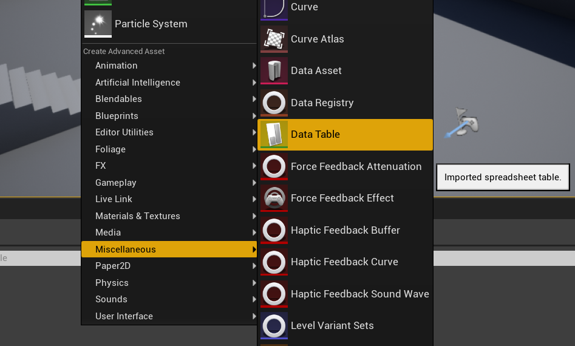

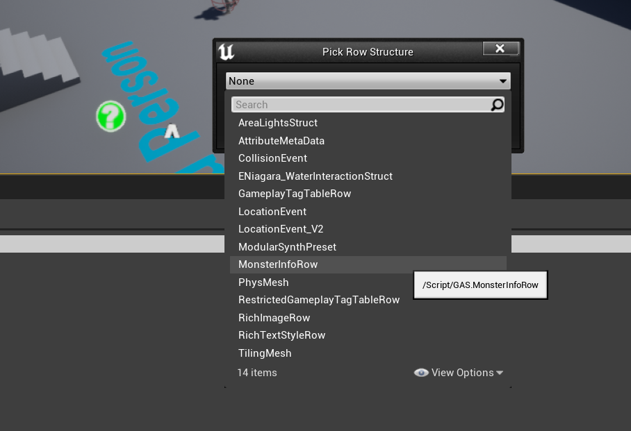

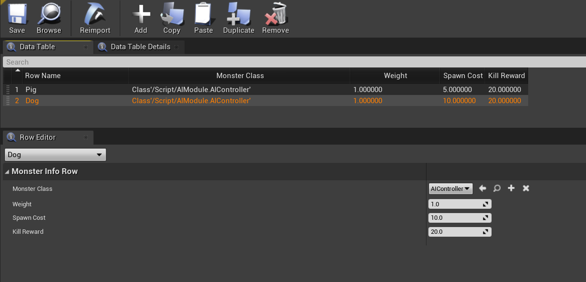

### 1.3 使用 DataTable

- 在 C++中调用

  ```C++
  void ATADataTable::BeginPlay()
  {
      Super::BeginPlay();


      if (MonsterTable)
      {
          TArray<FMonsterInfoRow*> Rows;
          MonsterTable->GetAllRows("", Rows);
          for (const FMonsterInfoRow* MonsterInfo : Rows)
          {
              UE_LOG(LogTemp, Log, TEXT("Monster: %s, Weight: %f, Kill Reward: %f"),
                  *MonsterInfo->MonsterClass->GetName(), MonsterInfo->Weight, MonsterInfo->KillReward);
          }
      }
  }
  ```

  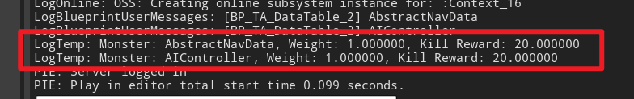

- 在蓝图中使用
  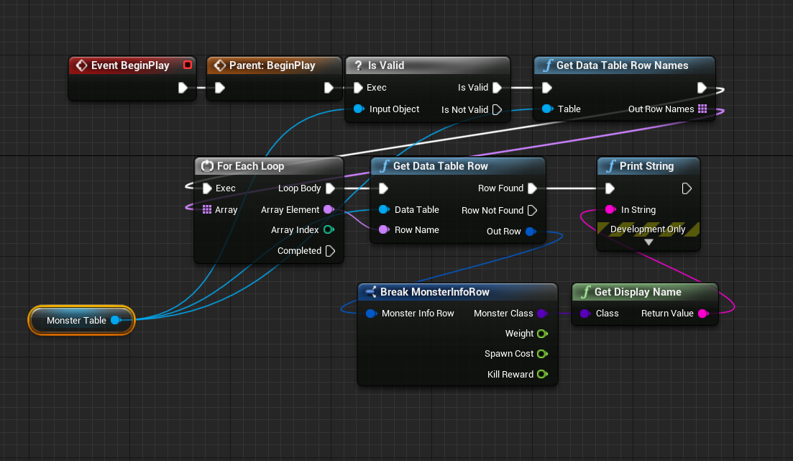

  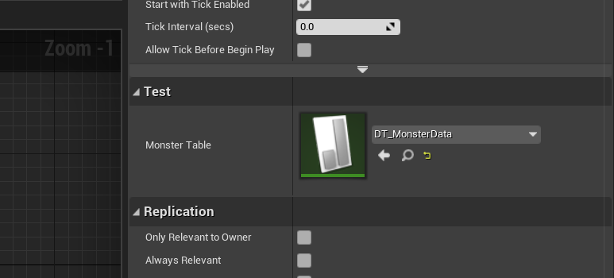

## 2. DataAsset

### 2.1 创建 DataAsset 类

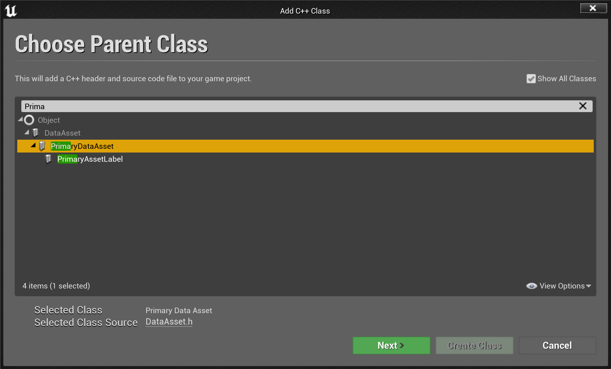

```C++
UCLASS()
class GAS_API UMonsterData : public UPrimaryDataAsset
{
    GENERATED_BODY()

public:
    UPROPERTY(EditDefaultsOnly, BlueprintReadOnly, Category="Test")
    TSubclassOf<AActor> MonsterClass;

    UPROPERTY(EditDefaultsOnly, BlueprintReadOnly, Category="Test")
    TArray<TSubclassOf<UGameplayAbility>> Abilities;

    UPROPERTY(EditDefaultsOnly, BlueprintReadOnly, Category="Test")
    UTexture2D* Icon;
};
```

在原本的 DataTable 中添加 UMonsterData 变量

```C++
{
    // ...
    FMonsterInfoRow()
    {
        MonsterData = nullptr;
        Weight = 1.0f;
        SpawnCost = 5.0f;
        KillReward = 20.0f;
    }

    UPROPERTY(EditAnywhere, BlueprintReadOnly)
    UMonsterData* MonsterData;
    // ...
}
```

### 2.2 创建 DataAsset 实例

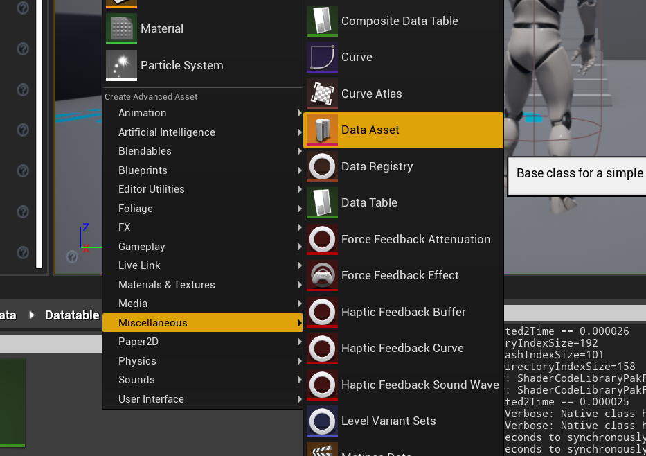

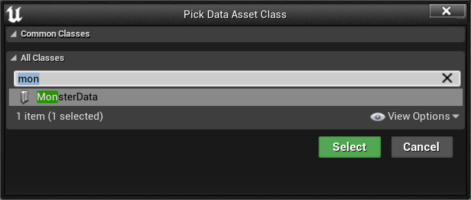

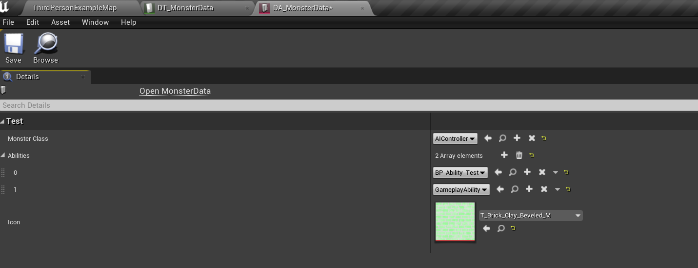

### 2.3 使用 DataAsset

- 在 C++中使用

  ```C++
  void ATADataTable::BeginPlay()
  {
      Super::BeginPlay();
      if (MonsterTable)
      {
          TArray<FMonsterInfoRow*> Rows;
          MonsterTable->GetAllRows("", Rows);
          for (const FMonsterInfoRow* MonsterInfo : Rows)
          {
              // Data Table
              UE_LOG(LogTemp, Log, TEXT("Monster: %s, Weight: %f, Kill Reward: %f"),
                  *MonsterInfo->MonsterClass->GetName(), MonsterInfo->Weight, MonsterInfo->KillReward);

              // Data Asset
              UE_LOG(LogTemp, Log, TEXT("Monster Class: %s"),
                  *MonsterInfo->MonsterData->MonsterClass->GetName());
          }
      }
  }
  ```

- 在蓝图中使用

  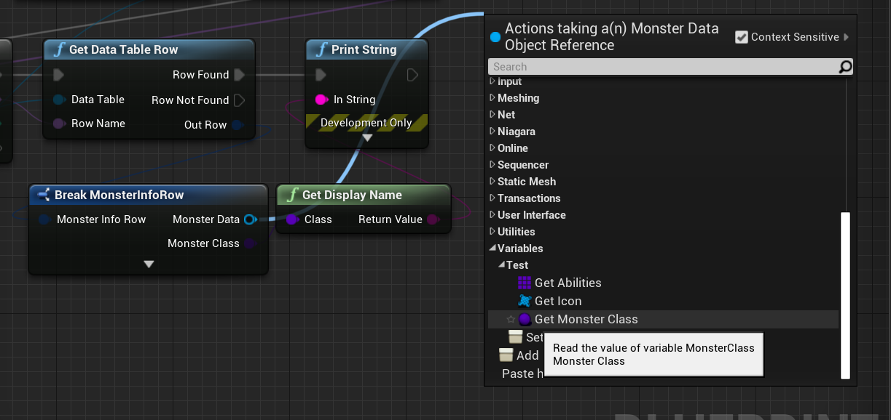

## 3. Curve

Curve 直接在编辑器中创建并使用

- 直接使用

  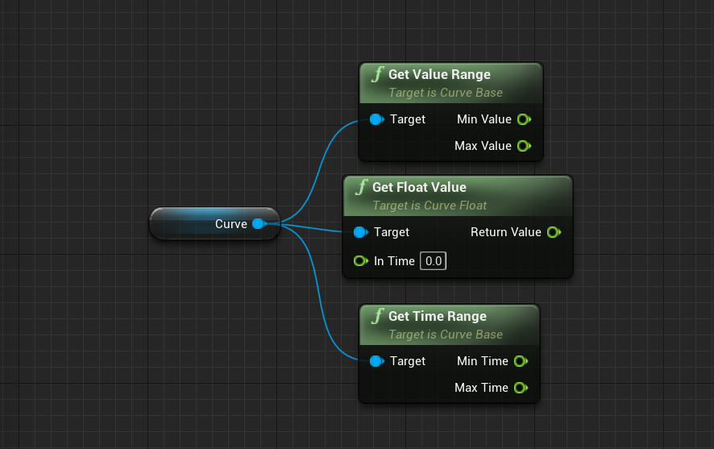

- 在 Timeline 中使用

  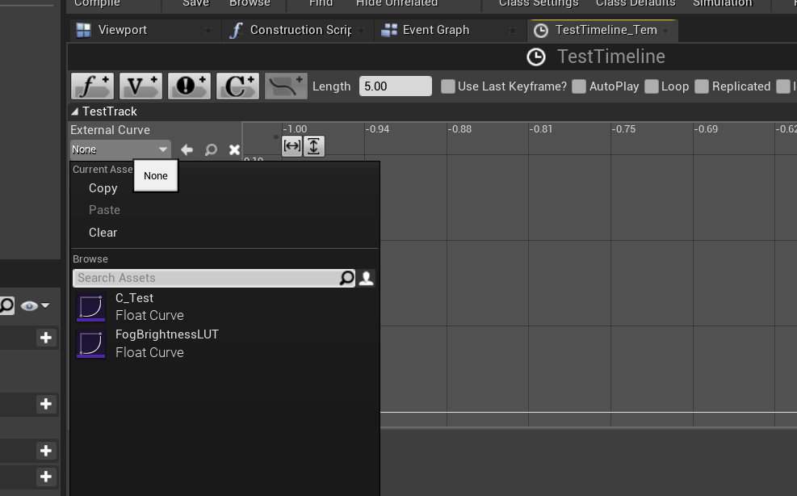

## 4. Curve Table

使用 Excell 编辑后转为 CSV 格式,可以直接拖到 UE 中以 CurveTable 的形式保存

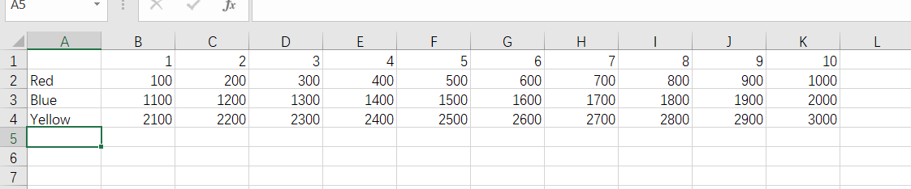

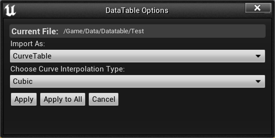

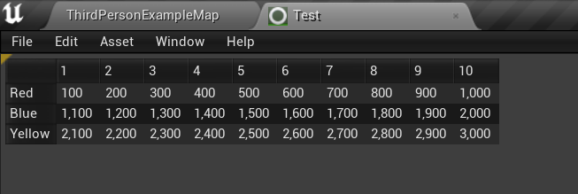

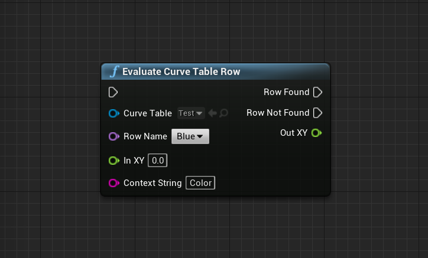

## 5. ConsoleVariables

[ConsoleVariables](https://docs.unrealengine.com/4.27/zh-CN/ProductionPipelines/DevelopmentSetup/Tools/ConsoleManager/)

[Flag API](https://docs.unrealengine.com/5.1/en-US/API/Runtime/Core/HAL/EConsoleVariableFlags/)

### 5.1 声明 ConsoleVariables

```C++
static TAutoConsoleVariable<bool> CDataDebugBool(
    TEXT("datatest.bool"),
    false,
    TEXT("A variable for test,\n")
    TEXT("set true to enable tick log."),
    ECVF_Cheat);

// 只在未处于相同cpp文件中时需要
// extern TAutoConsoleVariable<int32> CVarRefractionQuality;
```

定义的控制台变量名字需要在 ini 文件中定义的(好像不太行...)

```text
; ConsoleVariables.ini
;
; Why we have this file:
;  A developer can change it locally to save time not having to type repetitive console variable settings.
;  This file should be in the source control database (for the comments and to know where to find it) but kept empty expect from comments.
;
; Details:
;  This file allows to set console variables (cvars) on engine startup (order is not defined).
;  This is the only ini file where we allow to load cvars marked as ECVF_Cheat. We don't load this file when compiling UE_BUILD_SHIPPING or UE_BUILD_TEST.
;  The variables need to be in the section called [Startup] (typical ini file syntax).
;  The name comparison is not case sensitive and if the variable doesn't exists it's silently ignored.
;  Lines are commented by a leading ";"
;  Using a friendly name (e.g. Yes, No, True, False, On, Off) is supported and it converts those into 0 or 1.
;
; Other way to set cvars:
;  in engine ini files (e.g. BaseEngine.ini, DefaultEngine.ini) in the [SystemSettings] section
;  from the in game console or in editor OutputLog
;  Device Profiles
;  Platform settings (editor UI)
;
; What if the cvar wasn't created yet:
;  The system creates a dummy cvar which is hidden by the system until someone creates a cvar with that name, then it copies over it's value.
;  This is also the reason why there is no error message if a cvar doesn't exits.
;
; Example file content:
;  [Startup]
;  r.FogDensity = 0.9
;  post.ImageGrain = 0.5
;
; ###########################################################################################################

[Startup]

; Uncomment to get detailed logs on shader compiles and the opportunity to retry on errors
;r.ShaderDevelopmentMode=1
; Uncomment to dump shaders in the Saved folder
; Warning: leaving this on for a while will fill your hard drive with many small files and folders
;r.DumpShaderDebugInfo=1
; When this is enabled, dumped shader paths will get collapsed (in the cases where paths are longer than the OS's max)
;r.DumpShaderDebugShortNames=1
; When this is enabled, when dumping shaders an additional file to use with ShaderCompilerWorker -direct mode will be generated
;r.DumpShaderDebugWorkerCommandLine=1
; Uncomment to enable parallel rendering at startup
;r.RHICmdBypass=0

; r.XGEShaderCompile is now enabled by default in source. Uncomment to disable XGE shader compilation.
;r.XGEShaderCompile = 0
; Uncomment when running with a graphical debugger (but not when profiling)
;r.Shaders.Optimize=0
;r.Shaders.KeepDebugInfo=1

; If Linux editor crashes in FMallocBinned with callstack that mentions MeshUtilities, you may need to uncomment this.
;r.TriangleOrderOptimization=2

; Uncomment to disable engine and app registration, e.g. to disable GPU driver optimizations during debugging and development
; (Setting r.ShaderDevelopmentMode=1 will also disable engine and app registration)
;r.DisableEngineAndAppRegistration=1

; Uncomment to enable frame markers in D3D12 for the Radeon GPU Profiler (RGP)
; (Vulkan will auto-enable frame markers for RGP, but in D3D12, they have to be enabled manually for now.)
;D3D12.EmitRgpFrameMarkers=1
;r.AsyncPipelineCompile=0
```

### 5.2 使用 ConsoleVariables

- 在 C++中使用

  ```C++
  void ATADataTable::Tick(float DeltaSeconds)
  {
      Super::Tick(DeltaSeconds);

      // CDataDebugBool->Set(true);

      if(CDataDebugBool.GetValueOnGameThread())
      {
          UE_LOG(LogTemp, Log, TEXT("Test tick log."));
      }
  }
  ```

- 在蓝图中使用

  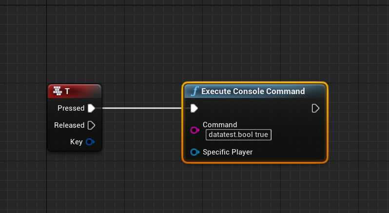

- 在游戏中使用

  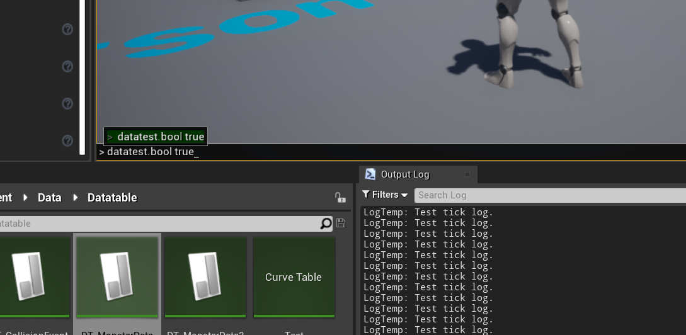

## TODO

// TODO Soft References

// Primary Assets
