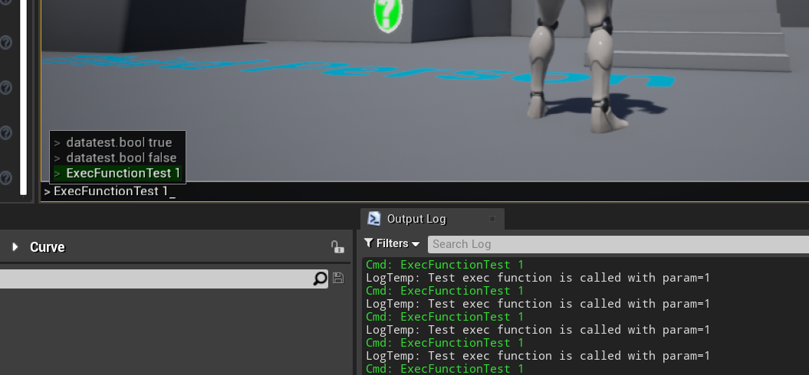
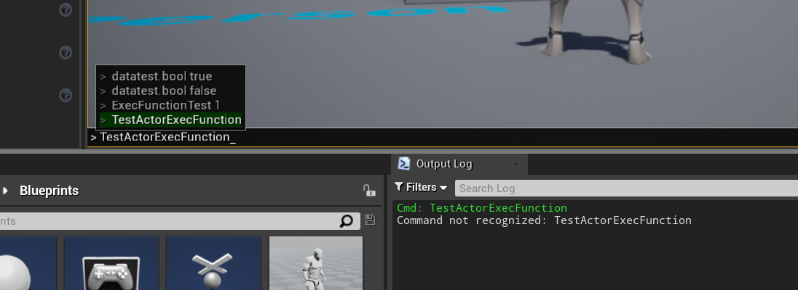

# Debug

## 1. Exec Functions

[参考资料 | UE4 Guidebook](https://unreal.gg-labs.com/wiki-archives/common-pitfalls/exec-functions)

> 可以配合 Data 中的 ConsoleVariables 一块儿用

Exec Functions 是被 `UFUNCTION(Exec)` 标记的,可以在游戏控制台直接执行的函数  
只能在 Possessed Pawns, Player Controllers, Player Input, Cheat Managers, Game Modes, Game Instances, overriden Game Engine classes,Huds Class 中定义 Exec Function.

```C++
UFUNCTION(Exec)
void ExecFunctionTest(const int32 param);

void AGASCharacter::ExecFunctionTest(const int32 param)
{
    UE_LOG(LogTemp, Log, TEXT("Test exec function is called with param=%d"), param);
}
```



想要在自定义的 Actor 上调用,需要重写 PlayerController 或者 GameViewport 的`ProcessConsoleExec`函数,手动找到自定义 Actor 的实例进行处理

```C++
UCLASS()
class GAS_API ATestPlayerController : public APlayerController
{
    GENERATED_BODY()

public:
    virtual void PostProcessInput(const float DeltaTime, const bool bGamePaused) override;
};

bool ATestPlayerController::ProcessConsoleExec(const TCHAR* Cmd, FOutputDevice& Ar, UObject* Executor)
{
    bool handled = Super::ProcessConsoleExec(Cmd, Ar, Executor);
    if (!handled)
    {
        TArray<AActor*> FoundActors;

        UGameplayStatics::GetAllActorsOfClass(GetWorld(), ATestActor::StaticClass(), FoundActors);
        if (FoundActors.Num() > 0)
        {
            ATestActor* Result = Cast<ATestActor>(FoundActors[0]);

            if (Result) handled &= Result->ProcessConsoleExec(Cmd, Ar, Executor);
        }
    }
    return handled;
}

void ATestActor::TestActorExecFunction()
{
    UE_LOG(LogTemp, Log, TEXT("Test exec function is called from TestActor"));
}
```



## 2. Debug && Log

[Draw 3D Debug Points,Lines,and Spheres:Visualize your algorithm in Action](https://nerivec.github.io/old-ue4-wiki/pages/draw-3d-debug-points-lines-and-spheres-visualize-your-algorithm-in-action.html)

```C++
// 控制台 Log
// CategoryName, Level, Text
UE_LOG(LogTemp, Log, TEXT("Running: %s"), *ActionName.ToString());

// 屏幕输出
GEngine->AddOnScreenDebugMessage(-1, 2.0f, FColor::Red, FailedMessage);

// 将 Widget 映射到空间中
FVector2D ScreenPosition;
if (UGameplayStatics::ProjectWorldToScreen(GetOwningPlayer(), AttachedActor->GetActorLocation() + WorldOffset, ScreenPosition))
{
    float ViewportScale = UWidgetLayoutLibrary::GetViewportScale(this);
    ScreenPosition /= ViewportScale;

    if (ParentSizeBox)
    {
        ParentSizeBox->SetRenderTranslation(ScreenPosition);
    }
}

// Debug Line
// void DrawDebugLine(
//     const UWorld* InWorld,
//     FVector const& LineStart,
//     FVector const& LineEnd,
//     FColor const& Color,
//     bool bPersistentLines = false,
//     float LifeTime = -1,
//     uint8 DepthPriority = 0,
//     float Thickness = 0)
DrawDebugLine(GetWorld(), TraceStart, TraceEnd, FColor::Red, bPersistentLines=false, LifeTime=2.0f, DepthPriority=0, Thickness=2);


// Debug Sphere
// void DrawDebugSphere(
//     const UWorld* InWorld,
//     FVector const& Center,
//     float Radius,
//     int32 Segments,
//     FColor const& Color,
//     bool bPersistentLines = false,
//     float LifeTime = -1,
//     uint8 DepthPriority = 0,
//     float Thickness = 0)
DrawDebugSphere(GetWorld(), Hit.ImpactPoint, Radius, 32, LineColor, bPersistentLines=false, LifeTime=2.0f);

// Debug String
// void DrawDebugString(
//     const UWorld* InWorld,
//     FVector const& TextLocation,
//     const FString& Text,
//     AActor* TestBaseActor = 0,
//     FColor const& TextColor = FColor::White,
//     float Duration = -1,
//     bool bDrawShadow = false,
//     float FontScale = 1)
DrawDebugString(GetWorld(), GetActorLocation(), "PLAYER SPOTTED", nullptr, FColor::Red, Duration=5.0f);
```

## 3. Console Command

| 命令           | 作用                   |
| :------------- | :--------------------- |
| show COLLISION | 显示碰撞盒子           |
| stat game      | 显示各种操作消耗的时间 |
