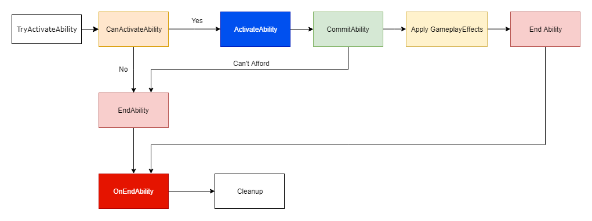
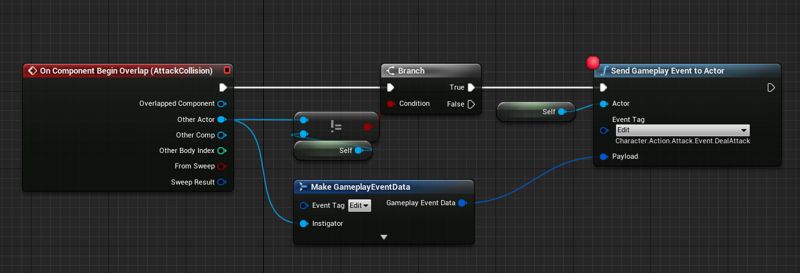
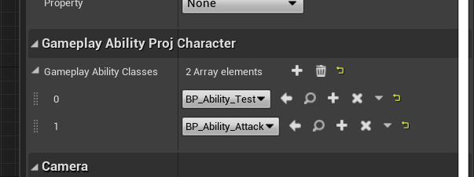
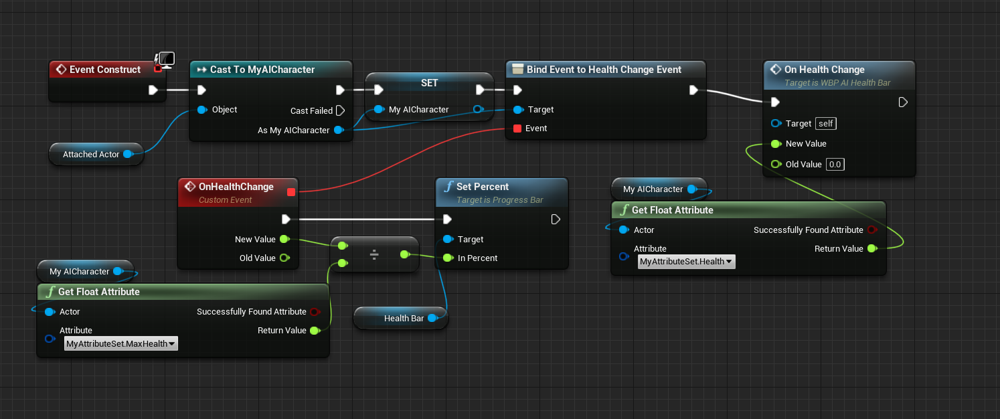

# Gameplay Ability System

参考资料:

> - [GASDocumentation(最重要) | Github](https://github.com/tranek/GASDocumentation)
> - [虚幻四 Gameplay Ability System 入门 | 知乎 | 高贵纯合子](https://www.zhihu.com/column/c_1369465754702684160)
> - [深入理解 UE4：技能插件 GameplayAbilitySystem | 知乎 | 蛋丁的人参](https://zhuanlan.zhihu.com/p/57300454)
> - [UE4 Gameplay Ability System 相关资料 | 知乎 | 李健宽](https://zhuanlan.zhihu.com/p/158756382)
> - [Gameplay Ability System | 虚幻文挡](https://docs.unrealengine.com/en-US/gameplay-ability-system-for-unreal-engine/)

## 1. 概念

参考资料:

> - [Gameplay Abilities | Unreal Slides](https://docs.google.com/presentation/d/1GeuDO2as1b12ei5OHh6jyfxczVYymXJQDBWoRLDMpOI/edit#slide=id.g38b84aa984_0_7)
> - [GASDocumentation(最重要) | Github](https://github.com/tranek/GASDocumentation)
> - [Using Gameplay Tags in C++| JAMES BAXTER](https://jambax.co.uk/using-gameplay-tags-in-cpp/)

### 1.1 AbilitySystemComponent

Actor 需要实现 IAbilitySystemInterface 中的 GetAbilitySystemComponent 方法来提供自己的技能组件(不一定是自己创建的)

ASC(AbilitySystemComponent) 的 OwnerActor 和 AvatarActor 大部分时候是相同的,但是也有可能是不同的,如在 Moba 游戏中可以这么设置:

> OwnerActor ==> PlayerState  
> AvatarActor ==> Character

如果 ASC 在 PlayerState 上,则需要调整其 NetUpdateFrequency,过低的更新频率可能导致延迟

```C++
// 创建技能系统
AbilitySystem = CreateDefaultSubobject<UAbilitySystemComponent>(TEXT("AbilitySystem"));
AbilitySystem->SetIsReplicated(true);

// On pawns after possession
// ASC 属于玩家控制的 Pawn
//      对于玩家控制角色, 在 Character 类的 PossessedBy 函数中设置
//      对于 AI 控制角色,在 AIPlayerController 中的 AcknowledgePossession 函数中设置
void APACharacterBase::PossessedBy(AController * NewController)
{
    Super::PossessedBy(NewController);

    if (AbilitySystemComponent)
    {
        AbilitySystemComponent->InitAbilityActorInfo(this, this);
    }

}
void APAPlayerControllerBase::AcknowledgePossession(APawn* P)
{
    Super::AcknowledgePossession(P);

    APACharacterBase* CharacterBase = Cast<APACharacterBase>(P);
    if (CharacterBase)
    {
        CharacterBase->GetAbilitySystemComponent()->InitAbilityActorInfo(CharacterBase, CharacterBase);
    }
}
// ASC 属于玩家的 PlayerState
//      对于玩家控制角色, 在 Character 类的 PossesedBy 函数中设置
//      对于 AI 控制角色,在
void AGDHeroCharacter::PossessedBy(AController * NewController)
{
    Super::PossessedBy(NewController);

    AGDPlayerState* PS = GetPlayerState<AGDPlayerState>();
    if (PS)
    {
        // Set the ASC on the Server. Clients do this in OnRep_PlayerState()
        AbilitySystemComponent = Cast<UGDAbilitySystemComponent>(PS->GetAbilitySystemComponent());

        // AI won't have PlayerControllers so we can init again here just to be sure. No harm in initing twice for heroes that have PlayerControllers.
        PS->GetAbilitySystemComponent()->InitAbilityActorInfo(PS, this);
    }
}
void AGDHeroCharacter::OnRep_PlayerState()
{
    Super::OnRep_PlayerState();

    AGDPlayerState* PS = GetPlayerState<AGDPlayerState>();
    if (PS)
    {
        // Set the ASC for clients. Server does this in PossessedBy.
        AbilitySystemComponent = Cast<UGDAbilitySystemComponent>(PS->GetAbilitySystemComponent());

        // Init ASC Actor Info for clients. Server will init its ASC when it possesses a new Actor.
        AbilitySystemComponent->InitAbilityActorInfo(PS, this);
    }
}
```

ASC 用 `FActiveGameplayEffectsContainer ActiveGameplayEffects` 保存已激活的 `GameplayEffects`

ASC 用 `FGameplayAbilitySpecContainer ActivatableAbilities` 存储 `Gameplay Abilities`,在对其进行迭代前需要用宏加锁

```C++
{
    ABILITYLIST_SCOPE_LOCK();
    // 对 ActivatableAbilities.Items 进行访问
    // 不能在锁的作用域内移除 ActivatableAbilities 中的元素
    // 因为移除动作本身也会加锁(需要宏锁数量为0, 和前面的宏锁冲突)
}
```

ASC 可以对其拥有的属性进行复制(Attributes 除外,其需要对应的 AttributeSet 手动负责),其包含三种复制模式

| Replication Mode | When to Use                           | Description                                                                                                              |
| :--------------- | :------------------------------------ | :----------------------------------------------------------------------------------------------------------------------- |
| Full             | Single Player                         | Every GameplayEffect is replicated to every client.                                                                      |
| Mixed            | Multiplayer, player controlled Actors | GameplayEffects are only replicated to the owning client. Only GameplayTags and GameplayCues are replicated to everyone. |
| Minimal          | Multiplayer, AI controlled Actors     | GameplayEffects are never replicated to anyone. Only GameplayTags and GameplayCues are replicated to everyone.           |

### 1.2 GameplayTags

GameplayTags 通常用来描述一个 Actor 的状态(Buff),其存储在 `GameplayTagContainer` 中.  
如果 GameplayTags 是通过 GameplayEffect 改变的则将被复制.

GameplayTags 可以在项目设置中创建和管理(也可以改配置文件和从 excel 表中引入),

GameplayTags 可以使用一系列逻辑运算函数: [Gameplay 标记运算](https://docs.unrealengine.com/4.26/zh-CN/ProgrammingAndScripting/Tags/)

```C++
UPROPERTY(EditAnywhere, BlueprintReadWrite, Category="GAS")
FGameplayTagContainer ActivateTags;

// Tag 变化回调函数声明
virtual void SpeedUpChanged(const FGameplayTag CallbackTag, int32 newCount);

void AGASCharacter::TagTest()
{
    // 获取 GameplayTag
    FGameplayTag Tag_SpeedUp = FGameplayTag::RequestGameplayTag(FName("Test.Character.SpeedUp"));

    // 用 UGameplayTagsManager 操作Tag(获取直接父tag)
    FGameplayTag Tag_Character = UGameplayTagsManager::Get().RequestGameplayTagDirectParent(Tag_SpeedUp);

    // 修改 Tag
    ActivateTags.AddTag(Tag_Character);
    ActivateTags.RemoveTag(Tag_Character);
    ActivateTags.AppendTags(ActivateTags);
    ActivateTags.RemoveTags(ActivateTags);

    // 检测Tag
    bool bHasAll = ActivateTags.HasAll(ActivateTags);
    bool bMatchesTag = Tag_SpeedUp.MatchesTag(Tag_Character);
    // ...
    // https://docs.unrealengine.com/4.27/en-US/ProgrammingAndScripting/Tags/#gameplaytagtestoperations

    // 注册回调函数,检测Tag的变化
    FOnGameplayEffectTagCountChanged OnSpeedUp_Changed = AbilitySystem->RegisterGameplayTagEvent(Tag_SpeedUp, EGameplayTagEventType::NewOrRemoved);
    OnSpeedUp_Changed.AddUObject(this, &AGASCharacter::SpeedUpChanged);
}
```

### 1.3 Attributes

Attributes 是一系列与玩家角色相关的 float,由 `FGameplayAttributeData` 定义,通常放在 `AttributeSet` 中管理.  
Attributes 应该只被 `GameplayEffects` 修改,此时在多人游戏中 ASC 可以预测 Attributes 的变化.

可以把 Attributes 看作是一个特化的浮点数,其有 BaseValue 和 CurrentValue 两部分组成,BaseValue 加上 GameplayEffects 造成的短期影响得到 CurrentValue  
GameplayEffects 中,Instant 和有周期(period)的 Duration GE 实例改变的是 BaseValue  
Infinite 和一般的 Duration 的 GE 实例改变的是 CurrentValue

// TODO Meta Attributes
[Meta Attributes](https://github.com/tranek/GASDocumentation#concepts-a-meta)

```C++
void AGASCharacter::AttributesTest()
{
    // 为 Attribute 的变化绑定回调函数
    FOnGameplayAttributeValueChange GameplayAttributeValueChangeDelegate = AbilitySystem->GetGameplayAttributeValueChangeDelegate(AttributeSet->GetHealthAttribute());
    GameplayAttributeValueChangeDelegate.AddUObject(this, &AGASCharacter::HealthChanged);
}

virtual void HealthChanged(const FOnAttributeChangeData& Data);
```

// TODO Derived Attributes
[Derived Attributes](https://github.com/tranek/GASDocumentation#435-derived-attributes)

### 1.4 AttributeSets

AttributeSets 存储并管理 Attributes.其内存消耗很小,因此可以不用过于担心内存消耗.  
可以为所有 Actor 设计一个通用的 AttributeSets,不同类的 Actor 只使用其中的一部分,也可以为每个 Actor 设计一个特有的 AttributeSets

```C++
// 用宏设置属性的设置和访问等
#define ATTRIBUTE_ACCESSORS(ClassName, PropertyName) \
GAMEPLAYATTRIBUTE_PROPERTY_GETTER(ClassName, PropertyName) \
GAMEPLAYATTRIBUTE_VALUE_GETTER(PropertyName) \
GAMEPLAYATTRIBUTE_VALUE_SETTER(PropertyName) \
GAMEPLAYATTRIBUTE_VALUE_INITTER(PropertyName)


// 定义属性(FGameplayAttributeData)并用宏设置访问和设置等内容
UPROPERTY(VisibleAnywhere, BlueprintReadWrite, Category="GAS", ReplicatedUsing="OnRep_Health")
FGameplayAttributeData Health;
ATTRIBUTE_ACCESSORS(UAttributeSetBase, Health);


// 复制行为
UFUNCTION()
virtual void OnRep_Health(const FGameplayAttributeData& OldHealth);

// 对属性变量本身进行复制
void UAttributeSetBase::GetLifetimeReplicatedProps(TArray<FLifetimeProperty>& OutLifetimeProps) const
{
    Super::GetLifetimeReplicatedProps(OutLifetimeProps);

    DOREPLIFETIME_CONDITION_NOTIFY(UAttributeSetBase, Health, COND_None, REPNOTIFY_Always);
    DOREPLIFETIME_CONDITION_NOTIFY(UAttributeSetBase, MaxHealth, COND_None, REPNOTIFY_Always);
}

// 用 GAS 中的宏接管属性变化事件
void UAttributeSetBase::OnRep_Health(const FGameplayAttributeData& OldHealth)
{
    GAMEPLAYATTRIBUTE_REPNOTIFY(UAttributeSetBase, Health, OldHealth);
}

{
    // AttributeSets 可以在运行时被添加和移除(但是很危险,可能导致游戏崩溃)
    // 运行时添加某些属性
    AbilitySystem->GetSpawnedAttributes_Mutable().AddUnique(AttributeSet);
    AbilitySystem->ForceReplication();

    // 运行时删除某些属性
    AbilitySystem->GetSpawnedAttributes_Mutable().Remove(AttributeSet);
    AbilitySystem->ForceReplication();

    // 使用 ATTRIBUTE_ACCESSORS 宏定义的初始化函数
    AttributeSet->InitHealth(100.0f);
    // 通常将 MaxValue 定义为另一个属性, BaseValue并不是MaxValue
    AttributeSet->InitMaxHealth(100.0f);
}
```

Attributes 设计模式(以枪和子弹数量为例)

- [直接将属性以 float 的形式放在 Item 上](https://github.com/tranek/GASDocumentation#44231-plain-floats-on-the-item)
  - 优点:
    - 规避了第二种方法的缺点
  - 缺点:
    - 不能使用 ASC 的标准流程(使用 GE 修改属性等)
    - 可能需要 override 一些 UGameplayAbility 上的方法来检查这些野生的属性
- [使用 AttributeSet 管理 Item 上的属性](https://github.com/tranek/GASDocumentation#44232-attributeset-on-the-item)
  - 优点:
    - 可以使用 ASC 的标准流程
    - 简单易用
  - 缺点:
    - 需要为每个枪设计一个子弹 AttributeSet 类,因为一个 Character 上如果有多个同类实例对象(AttributeSet),GE 修改时只会修改第一个
    - 玩家每个枪只能有一把(原因和前面一样)
    - 添加/移除 AttributeSet 是很危险的
- [使用 ASC 管理 Item 上的属性](https://github.com/tranek/GASDocumentation#44233-asc-on-the-item): 路子比较野,不用太在意

```C++
// 该函数会被任何形式的对 Attribute 的修改触发
// 包括 GE 的修改和直接使用 Setter 的修改(由宏定义的Setter)
// 这个函数一般只用来做 Clamp,不因该用来绑定事件
void UAttributeSetBase::PreAttributeChange(const FGameplayAttribute& Attribute, float& NewValue)
{
    Super::PreAttributeChange(Attribute, NewValue);

    // GetHealthAttribute 也是由宏生成的函数
    if(Attribute==GetHealthAttribute())
    {
        // 完成 Clamp
        NewValue = FMath::Clamp(NewValue, 0.0f, 100.0f);
    }
}

// GE 对属性修改后触发
PostGameplayEffectExecute(const FGameplayEffectModCallbackData & Data);
```

### 1.5 GameplayEffects

GE 是一种纯数据类,定义了技能的立即效果(Attributes 改变)和 Buff 效果(GamepalyTag)

| Duration Type | GameplayCue Event | When to use                                                                                                                                                                                                                      |
| :------------ | :---------------- | :------------------------------------------------------------------------------------------------------------------------------------------------------------------------------------------------------------------------------- |
| Instant       | Execute           | For immediate permanent changes to Attribute's BaseValue. GameplayTags will not be applied, not even for a frame.                                                                                                                |
| Duration      | Add & Remove      | For temporary changes to Attribute's CurrentValue and to apply GameplayTags that will be removed when the GameplayEffect expires or is manually removed. The duration is specified in the UGameplayEffect class/Blueprint.       |
| Infinite      | Add & Remove      | For temporary changes to Attribute's CurrentValue and to apply GameplayTags that will be removed when the GameplayEffect is removed. These will never expire on their own and must be manually removed by an ability or the ASC. |

```C++
void AGASCharacter::GameplayEffectsTest()
{
    // Apply GE
    // FGameplayEffectSpec GE;
    // AbilitySystem->ApplyGameplayEffectToSelf
    // AbilitySystem->ApplyGameplayEffectToTarget
    // AbilitySystem->ApplyGameplayEffectSpecToSelf
    // AbilitySystem->ApplyGameplayEffectSpecToTarget

    // Remove GE
    // AbilitySystem->RemoveActiveGameplayEffect


    // Server 保证调用
    // autonomous 角色(自己控制的角色)会在复制模式为 Full 和 Mixed 时调用该函数
    // Simulated 角色(其他玩家控制的角色)仅在 Full 时调用
    // 监听 Duration/Infinite 的 GE 事件
    // 监听 GE 移除事件
    AbilitySystem->OnActiveGameplayEffectAddedDelegateToSelf.AddUObject(
        this, &AGASCharacter::OnActiveGameplayEffectAddedCallback);
    AbilitySystem->OnAnyGameplayEffectRemovedDelegate().
                   AddUObject(this, &AGASCharacter::OnRemoveGameplayEffectCallback);
}
```

GE 使用 Modifier 来修改 Attribute 的值:

| Operation | Description                                                                                  |
| :-------- | :------------------------------------------------------------------------------------------- |
| Add       | Adds the result to the Modifier's specified Attribute. Use a negative value for subtraction. |
| Multiply  | Multiplies the result to the Modifier's specified Attribute.                                 |
| Divide    | Divides the result against the Modifier's specified Attribute.                               |
| Override  | Overrides the Modifier's specified Attribute with the result.                                |

计算顺序为: `((InlineBaseValue + Additive) * Multiplicitive) / Division`  
Overrider Modifier 比较特殊,其会最后生效并覆盖最终数值

[Modifier 的类型](https://github.com/tranek/GASDocumentation#454-gameplay-effect-modifiers):

| Modifier Type            | Description                                                                                                                                                                                                                                                                                                                                                                                                                                                                                                                                                                                                                                                                                                                                                                                                                                                                                                                                                                                        |
| :----------------------- | :------------------------------------------------------------------------------------------------------------------------------------------------------------------------------------------------------------------------------------------------------------------------------------------------------------------------------------------------------------------------------------------------------------------------------------------------------------------------------------------------------------------------------------------------------------------------------------------------------------------------------------------------------------------------------------------------------------------------------------------------------------------------------------------------------------------------------------------------------------------------------------------------------------------------------------------------------------------------------------------------- |
| Scalable Float           | FScalableFloats are a structure that can point to a Data Table that has the variables as rows and levels as columns. The Scalable Floats will automatically read the value of the specified table row at the ability's current level (or different level if overriden on the GameplayEffectSpec). This value can further be manipulated by a coefficient. If no Data Table/Row is specified, it treats the value as a 1 so the coefficient can be used to hard code in a single value at all levels. ScalableFloat                                                                                                                                                                                                                                                                                                                                                                                                                                                                                 |
| Attribute Based          | Attribute Based Modifiers take the CurrentValue or BaseValue of a backing Attribute on the Source (who created the GameplayEffectSpec) or Target (who received the GameplayEffectSpec) and further modifies it with a coefficient and pre and post coefficient additions. Snapshotting means the backing Attribute is captured when the GameplayEffectSpec is created whereas no snapshotting means the Attribute is captured when the GameplayEffectSpec is applied.                                                                                                                                                                                                                                                                                                                                                                                                                                                                                                                              |
| Custom Calculation Class | Custom Calculation Class provides the most flexibility for complex Modifiers. This Modifier takes a ModifierMagnitudeCalculation class and can further manipulate the resulting float value with a coefficient and pre and post coefficient additions.                                                                                                                                                                                                                                                                                                                                                                                                                                                                                                                                                                                                                                                                                                                                             |
| Set By Caller            | SetByCaller Modifiers are values that are set outside of the GameplayEffect at runtime by the ability or whoever made the GameplayEffectSpec on the GameplayEffectSpec. For example, you would use a SetByCaller if you want to set the damage to be based on how long the player held down a button to charge the ability. SetByCallers are essentially TMap<FGameplayTag, float> that live on the GameplayEffectSpec. The Modifier is just telling the Aggregator to look for a SetByCaller value associated with the supplied GameplayTag. The SetByCallers used by Modifiers can only use the GameplayTag version of the concept. The FName version is disabled here. If the Modifier is set to SetByCaller but a SetByCaller with the correct GameplayTag does not exist on the GameplayEffectSpec, the game will throw a runtime error and return a value of 0. This might cause issues in the case of a Divide operation. See SetByCallers for more information on how to use SetByCallers. |

// TODO Gameplay Tags on Modifiers
[Gameplay Tags on Modifiers](https://github.com/tranek/GASDocumentation#4542-gameplay-tags-on-modifiers)

// TODO Stacking Gameplay Effects
[Stacking Gameplay Effects](https://github.com/tranek/GASDocumentation#455-stacking-gameplay-effects)

GE 可以给 ASC 绑定新的 GA(只有 Duration 和 Infinite 的 GE 可以).  
常用的场景是希望技能给对方一个强制位移之类的控制效果,可以给对方上一个自动激活(automatically activating)的 GA

在 GE 被移除时,被绑定的 GA 有三种移除策略:

| Removal Policy             | Description                                                                                                                                                                   |
| :------------------------- | :---------------------------------------------------------------------------------------------------------------------------------------------------------------------------- |
| Cancel Ability Immediately | The granted ability is canceled and removed immediately when the GameplayEffect that granted it is removed from the Target.                                                   |
| Remove Ability on End      | The granted ability is allowed to finish and then is removed from the Target.                                                                                                 |
| Do Nothing                 | The granted ability is not affected by the removal of the granting GameplayEffect from the Target. The Target has the ability permanently until it is manually removed later. |

设置自动激活示例代码:

```C++
// 该函数在 GA 被 Granted 且 AvatarActor 被设置的时候被调用
void UGDGameplayAbility::OnAvatarSet(const FGameplayAbilityActorInfo * ActorInfo, const FGameplayAbilitySpec & Spec)
{
    Super::OnAvatarSet(ActorInfo, Spec);
    // 可以额外设置一个变量来控制是否自动激活
    if (bActivateAbilityOnGranted)
    {
        ActorInfo->AbilitySystemComponent->TryActivateAbility(Spec.Handle, false);
    }
}
```

[Gameplay Effect Tags](https://github.com/tranek/GASDocumentation#457-gameplay-effect-tags)
GE 可以带多个 GameplayTagContainer 来给目标添加 Tag  
其中一共有五种类别,由的类别包含 Added,Removed 两个 TagContainer,再加上继承父类得到的 Tag,最终结果记录在 CombinedGameplayTagContainer

| Category                          | Description                                                                                                                                                                                                                                                                                                                                                          |
| :-------------------------------- | :------------------------------------------------------------------------------------------------------------------------------------------------------------------------------------------------------------------------------------------------------------------------------------------------------------------------------------------------------------------- |
| Gameplay Effect Asset Tags        | Tags that the GameplayEffect has. They do not do any function on their own and serve only the purpose of describing the GameplayEffect.                                                                                                                                                                                                                              |
| Granted Tags                      | Tags that live on the GameplayEffect but are also given to the ASC that the GameplayEffect is applied to. They are removed from the ASC when the GameplayEffect is removed. This only works for Duration and Infinite GameplayEffects.                                                                                                                               |
| Ongoing Tag Requirements          | Once applied, these tags determine whether the GameplayEffect is on or off. A GameplayEffect can be off and still be applied. If a GameplayEffect is off due to failing the Ongoing Tag Requirements, but the requirements are then met, the GameplayEffect will turn on again and reapply its modifiers. This only works for Duration and Infinite GameplayEffects. |
| Application Tag Requirements      | Tags on the Target that determine if a GameplayEffect can be applied to the Target. If these requirements are not met, the GameplayEffect is not applied.                                                                                                                                                                                                            |
| Remove Gameplay Effects with Tags | GameplayEffects on the Target that have any of these tags in their Asset Tags or Granted Tags will be removed from the Target when this GameplayEffect is successfully applied.                                                                                                                                                                                      |

[Immunity](https://github.com/tranek/GASDocumentation#458-immunity)
直接使用 GE 中的 `Application Tag Requirements` 也可以达到技能免疫的效果,但是用 Immunity 专用的机制可以在被免疫的时候调用回调函数  
回调委托: UAbilitySystemComponent::OnImmunityBlockGameplayEffectDelegate

```C++
DECLARE_MULTICAST_DELEGATE_TwoParams(FImmunityBlockGE, const FGameplayEffectSpec& /*BlockedSpec*/, const FActiveGameplayEffect* /*ImmunityGameplayEffect*/);
AbilitySystemComponent->OnImmunityBlockGameplayEffectDelegate.AddUObject(xxx);
```

GrantedApplicationImmunityTags: 检查 ASC 的 AbilityTags 是否包含目标 Tag  
Granted Application Immunity Query: 更灵活,但更慢

[Gameplay Effect Spec](https://github.com/tranek/GASDocumentation#459-gameplay-effect-spec)
GES 是 GE 的实例,GE 在 Apply 的时候会创建一个 GES,且 GES 可以主动创建并修改  
构造方法: `UAbilitySystemComponent::MakeOutgoingSpec()`  
一般可以在使用 GA 后,给发射物生成并绑定一个 GES,其在命中后再将其 Apply.GES 生效后会返回一个 FActiveGameplayEffect 结构体

[SetByCallers](https://github.com/tranek/GASDocumentation#4591-setbycallers)
`SetByCaller` 整体是一个名词,是 GA 根据 GE 生成 GES 后,为其补充计算得到的属性  
在蓝图中用需要自己写库,在 C++中用(推荐使用 tag 版本,FName 版本可能写错字导致出错):

```C++
void FGameplayEffectSpec::SetSetByCallerMagnitude(FName DataName, float Magnitude);
void FGameplayEffectSpec::SetSetByCallerMagnitude(FGameplayTag DataTag, float Magnitude);
float GetSetByCallerMagnitude(FName DataName, bool WarnIfNotFound = true, float DefaultIfNotFound = 0.f) const;
float GetSetByCallerMagnitude(FGameplayTag DataTag, bool WarnIfNotFound = true, float DefaultIfNotFound = 0.f) const;
```

[Gameplay Effect Context](https://github.com/tranek/GASDocumentation#4510-gameplay-effect-context)
简而言之,和上面的 SetByCallers 类似,可以为 GES 带额外的信息,如 Instigator 和 TargetData  
可以自己写子类,带更多数据,比如 ModifierMagnitudeCalculations,AttributeSets 之类的

// TODO Modifier Magnitude Calculation
[Modifier Magnitude Calculation](https://github.com/tranek/GASDocumentation#4512-gameplay-effect-execution-calculation)

// TODO Cost Gameplay Effect
[Cost Gameplay Effect](https://github.com/tranek/GASDocumentation#4514-cost-gameplay-effect)

// TODO Cooldown Gameplay Effect
[Cooldown Gameplay Effect](https://github.com/tranek/GASDocumentation#4515-cooldown-gameplay-effect)

// TODO Changing Active Gameplay Effect Duration
[Changing Active Gameplay Effect Duration](https://github.com/tranek/GASDocumentation#4516-changing-active-gameplay-effect-duration)

// TODO Creating Dynamic Gameplay Effects at Runtime
[Creating Dynamic Gameplay Effects at Runtime](https://github.com/tranek/GASDocumentation#4517-creating-dynamic-gameplay-effects-at-runtime)

// TODO Gameplay Effect Containers
[Gameplay Effect Containers](https://github.com/tranek/GASDocumentation#4518-gameplay-effect-containers)

### 1.6 GameplayAbilities

GameplayAbilities 即玩家技能,提供两个接口来启动和结束: `ActivateAbility()`,`EndAbility()`

  


// TODO GameplayAbilities

### 1.7 Ability Tasks

// TODO

### 1.8 Abilities Cues

### 1.9 Abilitiy System Globals

资料来源[Ability System Globals](https://github.com/tranek/GASDocumentation#491-initglobaldata)

The AbilitySystemGlobals class holds global information about GAS. Most of the variables can be set from the DefaultGame.ini. Generally you won't have to interact with this class, but you should be aware of its existence.

Starting in UE 4.24, **it is now necessary to call** UAbilitySystemGlobals::Get().InitGlobalData() to use TargetData, otherwise you will get errors related to ScriptStructCache and clients will be disconnected from the server. This function only needs to be called once in a project. Fortnite calls it from UAssetManager::StartInitialLoading() and Paragon called it from UEngine::Init(). I find that putting it in UAssetManager::StartInitialLoading() is a good place as shown in the Sample Project. I would consider this boilerplate code that you should copy into your project to avoid issues with TargetData.

### 1.10 Prediction

### 1.11 Targeting

## 2. 实践

- 在 UE 的插件中开启 `Gameplay Abilities` 后重启
- 在 xxx.Build.cs 中添加依赖: GameplayAbilities, GameplayTasks, GameplayTags

### 2.1 创建相关 C++类

- 创建 AttributeSet

  ```C++
  #pragma once

  #include "CoreMinimal.h"
  #include "AttributeSet.h"
  #include "AbilitySystemComponent.h"
  #include "MyAttributeSet.generated.h"

  // To use this in your game you can define something like this, and then add game-specific functions as necessary:
  #define ATTRIBUTE_ACCESSORS(ClassName, PropertyName) \
  GAMEPLAYATTRIBUTE_PROPERTY_GETTER(ClassName, PropertyName) \
  GAMEPLAYATTRIBUTE_VALUE_GETTER(PropertyName) \
  GAMEPLAYATTRIBUTE_VALUE_SETTER(PropertyName) \
  GAMEPLAYATTRIBUTE_VALUE_INITTER(PropertyName)

  // ATTRIBUTE_ACCESSORS(UMyHealthSet, Health)


  /**
  *
  */
  UCLASS()
  class GAMEPLAYABILITYPROJ_API UMyAttributeSet : public UAttributeSet
  {
      GENERATED_BODY()

  public:
      UPROPERTY(EditAnywhere, BlueprintReadOnly)
      FGameplayAttributeData  Health;
      ATTRIBUTE_ACCESSORS(UMyAttributeSet, Health);

      UPROPERTY(EditAnywhere, BlueprintReadOnly)
      FGameplayAttributeData  MaxHealth;
      ATTRIBUTE_ACCESSORS(UMyAttributeSet, MaxHealth);

      UPROPERTY(EditAnywhere, BlueprintReadOnly)
      FGameplayAttributeData  Mana;
      ATTRIBUTE_ACCESSORS(UMyAttributeSet, Mana);

      UPROPERTY(EditAnywhere, BlueprintReadOnly)
      FGameplayAttributeData  MaxMana;
      ATTRIBUTE_ACCESSORS(UMyAttributeSet, MaxMana);
  };

  ```

- UMyGameplayAbility
- UMyGameplayEffect
- UMyAbilitySystemComponent

- PlayerCharacter

  ```C++
  {
      // 添加组件
      UPROPERTY(VisibleAnywhere, BlueprintReadOnly, Category="GameplayAbilitySystem")
      UMyAbilitySystemComponent* AbilitySystemComponent;

      UPROPERTY(VisibleAnywhere, BlueprintReadOnly, Category="GameplayAbilitySystem")
      UMyAttributeSet* AttributeSet;

      // 可使用技能列表
      UPROPERTY(EditDefaultsOnly, BlueprintReadWrite="GameplayAbilitySystem")
      TArray<TSubclassOf<UGameplayAbility>> GameplayAbilityClasses;

      // 技能 Action Delegate
      void ActionDelegate(int32 index, bool activate);
      DECLARE_DELEGATE_TwoParams(FActionDelegate, int32, bool);

  public:
      virtual UAbilitySystemComponent* GetAbilitySystemComponent() const override;

      virtual void BeginPlay() override;
  }

  {
      // 初始化组件
      AbilitySystemComponent = CreateDefaultSubobject<UMyAbilitySystemComponent>(TEXT("AbilitySystemComponent"));
      AttributeSet = CreateDefaultSubobject<UMyAttributeSet>(TEXT("AttributeSet"));
  }

  void AGameplayAbilityProjCharacter::BeginPlay()
  {
      Super::BeginPlay();

      // 添加所有技能
      for (const TSubclassOf<UGameplayAbility>& Ability : GameplayAbilityClasses)
      {
          AbilitySystemComponent->GiveAbility(FGameplayAbilitySpec(Ability));
      }
  }

  void AGameplayAbilityProjCharacter::ActionDelegate(int32 index, bool activate)
  {
      if (AbilitySystemComponent)
      {
          TArray<FGameplayAbilitySpec> GameplayAbilitySpecs = AbilitySystemComponent->GetActivatableAbilities();
          if (GameplayAbilitySpecs.Num() > index)
          {
              const FGameplayAbilitySpec Spec = GameplayAbilitySpecs[index];
              if (activate)
              {
                  if (!Spec.IsActive())
                  {
                      AbilitySystemComponent->TryActivateAbility(Spec.Handle);
                  }
              }else
              {
                  if(Spec.IsActive())
                  {
                      AbilitySystemComponent->CancelAbility(Spec.Ability);
                  }
              }
          }
      }
  }

  // 绑定输入
  {
      PlayerInputComponent->BindAction<FActionDelegate>("GameplayAbility1", IE_Pressed,
                                                      this, &ThisClass::ActionDelegate, 0, true);
      PlayerInputComponent->BindAction<FActionDelegate>("GameplayAbility2", IE_Pressed,
                                                      this, &ThisClass::ActionDelegate, 1, true);
      PlayerInputComponent->BindAction<FActionDelegate>("GameplayAbility3", IE_Pressed,
                                                      this, &ThisClass::ActionDelegate, 2, true);
      PlayerInputComponent->BindAction<FActionDelegate>("GameplayAbility4", IE_Pressed,
                                                      this, &ThisClass::ActionDelegate, 3, true);
  }
  ```

### 2.2 Gameplay Ability


### 2.3 创建 UI 类

- AttributeBar Widget
  主体用一个进度条表示属性,提供 `SetAttribute` 函数和 `FillColor` 属性用来设置属性值和前景色
  

- 在 PlayerCharacter 中定义属性变化 Delegate,并与属性值变化相关联

  ```C++
  // ================ 声明 ================
  DECLARE_DYNAMIC_MULTICAST_DELEGATE_TwoParams(FOnAttributeEvent, float, NewValue, float ,OldValue);

  // 属性变化 Delegate
  UPROPERTY(BlueprintAssignable, Category="GameplayAbilitySystem")
  FOnAttributeEvent HealthChangeEvent;
  UPROPERTY(BlueprintAssignable, Category="GameplayAbilitySystem")
  FOnAttributeEvent MaxHealthChangeEvent;

  UPROPERTY(BlueprintAssignable, Category="GameplayAbilitySystem")
  FOnAttributeEvent ManaChangeEvent;
  UPROPERTY(BlueprintAssignable, Category="GameplayAbilitySystem")
  FOnAttributeEvent MaxManaChangeEvent;

  // 广播函数
  void OnHealthChanged(const FOnAttributeChangeData& Data);
  void OnMaxHealthChanged(const FOnAttributeChangeData& Data);

  void OnManaChanged(const FOnAttributeChangeData& Data);
  void OnMaxManaChanged(const FOnAttributeChangeData& Data);

  // ================ 实现 ================

  void AGameplayAbilityProjCharacter::OnHealthChanged(const FOnAttributeChangeData& Data)
  {
  HealthChangeEvent.Broadcast(Data.NewValue, Data.OldValue);
  }

  void AGameplayAbilityProjCharacter::OnMaxHealthChanged(const FOnAttributeChangeData& Data)
  {
  MaxHealthChangeEvent.Broadcast(Data.NewValue, Data.OldValue);
  }

  void AGameplayAbilityProjCharacter::OnManaChanged(const FOnAttributeChangeData& Data)
  {
  ManaChangeEvent.Broadcast(Data.NewValue, Data.OldValue);
  }

  void AGameplayAbilityProjCharacter::OnMaxManaChanged(const FOnAttributeChangeData& Data)
  {
  MaxManaChangeEvent.Broadcast(Data.NewValue, Data.OldValue);
  }

  // 将属性变化与广播函数相关联
  void AGameplayAbilityProjCharacter::BeginPlay()
  {
  Super::BeginPlay();

  if (AbilitySystemComponent)
  {
  for (const TSubclassOf<UGameplayAbility>& Ability : GameplayAbilityClasses)
  {
  AbilitySystemComponent->GiveAbility(FGameplayAbilitySpec(Ability));
  }

  AbilitySystemComponent->GetGameplayAttributeValueChangeDelegate(AttributeSet->GetHealthAttribute())
                      .AddUObject(this, &ThisClass::OnHealthChanged);
  AbilitySystemComponent->GetGameplayAttributeValueChangeDelegate(AttributeSet->GetMaxHealthAttribute())
                      .AddUObject(this, &ThisClass::OnMaxHealthChanged);
  AbilitySystemComponent->GetGameplayAttributeValueChangeDelegate(AttributeSet->GetManaAttribute())
                      .AddUObject(this, &ThisClass::OnManaChanged);
  AbilitySystemComponent->GetGameplayAttributeValueChangeDelegate(AttributeSet->GetMaxManaAttribute())
                      .AddUObject(this, &ThisClass::OnMaxManaChanged);
  }
  }
  ```

- Main Widget

  创建两个 AttributeBar,分别绑定 Health 和 Mana 的处理(绑定后需要手动触发一次来初始化)

  
  

### 2.4 优化技能

- 在技能中增加技能消耗

  

- 使用 DataTable 初始化 AttributeSet

  

  

- 效果(释放技能消耗蓝条,蓝条不够的时候就不再释放技能)

  
  

### 3.5 制作药水

- 制作外观

  

- 制作浮动效果

  

- 触发后获取 ASC,并施加指定的 Effect

  

- 为 AttributeSet 添加修改

  ```C++
  // 在修改属性前调用
  virtual void PreAttributeChange(const FGameplayAttribute& Attribute, float& NewValue) override;

  void UMyAttributeSet::PreAttributeChange(const FGameplayAttribute& Attribute, float& NewValue)
  {
      Super::PreAttributeChange(Attribute, NewValue);

      if (Attribute == GetHealthAttribute())
      {
          NewValue = FMath::Clamp(NewValue, 0.0f, GetMaxHealth());
      }
      else if (Attribute == GetManaAttribute())
      {
          NewValue = FMath::Clamp(NewValue, 0.0f, GetMaxMana());
      }
  }
  ```

### 3.6 制作 AI

- C++ 基类,添加 ASC, Attribute, PawnSensingComponent 和 HealthBarWidgetClass

  ```C++
  // Fill out your copyright notice in the Description page of Project Settings.

  #pragma once

  #include "CoreMinimal.h"
  #include "AbilitySystemInterface.h"
  #include "GameplayAbilityProjCharacter.h"
  #include "AbilitySystem/MyAbilitySystemComponent.h"
  #include "AbilitySystem/MyAttributeSet.h"
  #include "GameFramework/Character.h"
  #include "UI/MyUserWidget.h"
  #include "Perception/PawnSensingComponent.h"
  #include "MyAICharacter.generated.h"

  DECLARE_DYNAMIC_MULTICAST_DELEGATE_TwoParams(FOnAIAttributeEvent, float, NewValue, float ,OldValue);

  UCLASS()
  class GAMEPLAYABILITYPROJ_API AMyAICharacter : public ACharacter, public IAbilitySystemInterface
  {
      GENERATED_BODY()

  protected:
      UPROPERTY(VisibleAnywhere, BlueprintReadOnly, Category="GameplayAbilitySystem")
      UMyAbilitySystemComponent* AbilitySystemComponent;

      UPROPERTY(VisibleAnywhere, Category="Components")
      UMyAttributeSet* AttributeComponent;

      UPROPERTY(VisibleAnywhere, Category="Components")
      UPawnSensingComponent* PawnSensingComponent;

      UPROPERTY(EditDefaultsOnly, Category="Widgets")
      TSubclassOf<UMyUserWidget> HealthBarWidgetClass;

      UPROPERTY(BlueprintAssignable, Category="GameplayAbilitySystem")
      FOnAIAttributeEvent HealthChangeEvent;
      UPROPERTY(BlueprintAssignable, Category="GameplayAbilitySystem")
      FOnAIAttributeEvent MaxHealthChangeEvent;

      void OnHealthChanged(const FOnAttributeChangeData& Data);
      void OnMaxHealthChanged(const FOnAttributeChangeData& Data);

      AGameplayAbilityProjCharacter* PlayerCharacter;

  public:
      virtual UAbilitySystemComponent* GetAbilitySystemComponent() const override;

      AMyAICharacter();

      virtual void BeginPlay() override;

      UFUNCTION()
      void OnSeePlayer(APawn* Pawn);
  };

  // Fill out your copyright notice in the Description page of Project Settings.


  #include "AI/MyAICharacter.h"

  #include "Perception/PawnSensingComponent.h"


  AMyAICharacter::AMyAICharacter()
  {
      PrimaryActorTick.bCanEverTick = true;

      AbilitySystemComponent = CreateDefaultSubobject<UMyAbilitySystemComponent>(TEXT("AbilitySystemComponent"));
      AttributeComponent = CreateDefaultSubobject<UMyAttributeSet>(TEXT("AttributeComponent"));
      PawnSensingComponent = CreateDefaultSubobject<UPawnSensingComponent>(TEXT("PawnSensingComponent"));
  }

  void AMyAICharacter::BeginPlay()
  {
      Super::BeginPlay();

      if (AbilitySystemComponent)
      {
          AbilitySystemComponent->GetGameplayAttributeValueChangeDelegate(AttributeComponent->GetHealthAttribute()).
                                  AddUObject(this, &AMyAICharacter::OnHealthChanged);
          AbilitySystemComponent->GetGameplayAttributeValueChangeDelegate(AttributeComponent->GetMaxHealthAttribute()).
                                  AddUObject(this, &AMyAICharacter::OnMaxHealthChanged);
      }

      if (PawnSensingComponent)
      {
          PawnSensingComponent->OnSeePawn.AddDynamic(this, &ThisClass::OnSeePlayer);
      }
  }

  void AMyAICharacter::OnSeePlayer(APawn* Pawn)
  {
      if (IsValid(PlayerCharacter))
      {
          return;
      }

      PlayerCharacter = Cast<AGameplayAbilityProjCharacter>(Pawn);
      if (PlayerCharacter)
      {
          UE_LOG(LogTemp, Log, TEXT("Player has been found."));
      }
  }


  UAbilitySystemComponent* AMyAICharacter::GetAbilitySystemComponent() const
  {
      return AbilitySystemComponent;
  }

  void AMyAICharacter::OnHealthChanged(const FOnAttributeChangeData& Data)
  {
      HealthChangeEvent.Broadcast(Data.NewValue, Data.OldValue);
  }

  void AMyAICharacter::OnMaxHealthChanged(const FOnAttributeChangeData& Data)
  {
      MaxHealthChangeEvent.Broadcast(Data.NewValue, Data.OldValue);
  }

  ```

- 创建 AIController

  ```C++
  #include "CoreMinimal.h"
  #include "AIController.h"
  #include "MyAIController.generated.h"

  /**
  *
  */
  UCLASS()
  class GAMEPLAYABILITYPROJ_API AMyAIController : public AAIController
  {
      GENERATED_BODY()
  protected:
      UPROPERTY(EditDefaultsOnly, Category="AI")
      UBehaviorTree* BehaviorTree;

      virtual void BeginPlay() override;
  };

  void AMyAIController::BeginPlay()
  {
      Super::BeginPlay();

      if (ensureMsgf(BehaviorTree, TEXT("Behavior Tree is nullptr, please assign HehaviorTree  in you AI controller.")))
      {
          RunBehaviorTree(BehaviorTree);
      }
  }

  ```

- 创建 AI 套件(行为树,Blackboard,EQS)
  - 记得添加 NavVolume,否则无法 moveto
  - 可以使用 EQSTestPawn 来可视化查询结果
  - 游戏中使用"开启调试信息,小键盘 4(具体是几看提示信息) 查看 EQS 结果


### 3.6 制作攻击

- 导入一个动作包,更换玩家模型,创建动画蓝图
- 创建一个 1D 的混合空间(速度-动画)
- 在手上的 socket 上添加一个武器,给武器添加一个伤害判定的碰撞体

  
  

- 创建攻击状态的 Tag

  

- 发生碰撞后向玩家本身发送 GameplayEventData

  

- 添加攻击开始/结束时间,开启和关闭攻击碰撞

  

- 创建 AnimNotifyState([参考资料](https://docs.unrealengine.com/4.27/en-US/AnimatingObjects/SkeletalMeshAnimation/Sequences/Notifies/),相对于 AnimNotify 的主要区别是有自带的蓝图),重载其函数,触发角色攻击事件

  

- 在攻击动画中写上这个 AnimNotifyState

  

- 用攻击动画创建 Montage

- 创建 AttackAbility,并放在角色技能栏

  
  

- 最后需要在 AnimBP 中加一个 slot 注册才能执行 Montage

  

- 在处理完伤害后输出一下测试信息

  
  

### 3.7 AI 受击效果

- 使用 DataTable 初始化 AI 数据

- 在 AI 受到伤害或者发现玩家时显示血条

  ```C++
  void AMyAICharacter::OnSeePlayer(APawn* Pawn)
  {
      if (IsValid(PlayerCharacter))
      {
          return;
      }

      PlayerCharacter = Cast<AGameplayAbilityProjCharacter>(Pawn);
      if (PlayerCharacter)
      {
          UE_LOG(LogTemp, Log, TEXT("Player has been found."));
          ShowHealthBar();
      }
  }


  void AMyAICharacter::ShowHealthBar()
  {
      if(HealthBarWidget==nullptr)
      {
          HealthBarWidget = CreateWidget<UMyUserWidget>(GetWorld(), HealthBarWidgetClass, FName("HealthBar"));
          if(HealthBarWidget)
          {
              HealthBarWidget->AttachedActor = this;
              HealthBarWidget->AddToViewport();
          }
      }
  }

  void AMyAICharacter::OnHealthChanged(const FOnAttributeChangeData& Data)
  {
      HealthChangeEvent.Broadcast(Data.NewValue, Data.OldValue);
      ShowHealthBar();
  }
  ```

- 制作血条 UI

  

- 修复之前的 Bug:OtherActor 应该连到 Target

  
