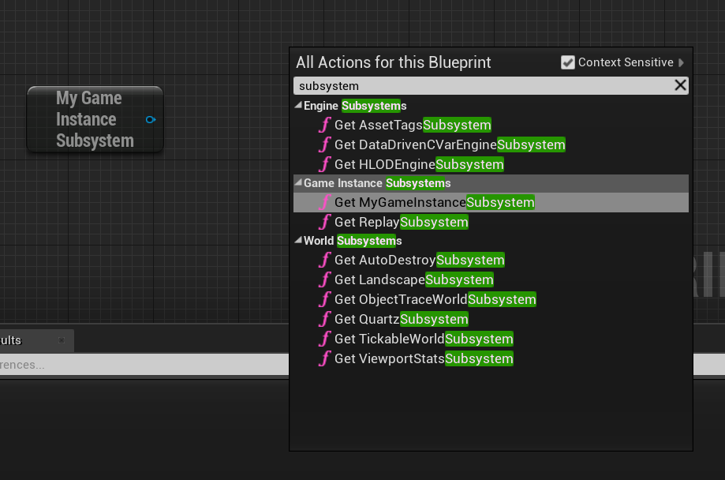
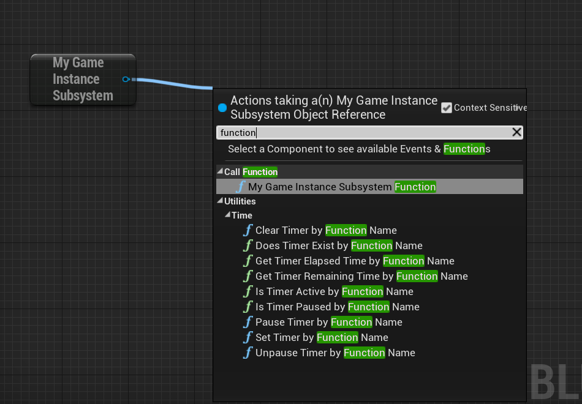

# SubSystem

[编程子系统 | Unreal文档](https://docs.unrealengine.com/4.27/zh-CN/ProgrammingAndScripting/Subsystems/)

## 1. 创建 Subsystem

```C++
UCLASS()
class GAS_API UMyGameInstanceSubsystem : public UGameInstanceSubsystem
{
    GENERATED_BODY()

public:
    virtual void Initialize(FSubsystemCollectionBase& Collection) override;
    
    virtual void Deinitialize() override;

    UFUNCTION(BlueprintCallable)
    void MyGameInstanceSubsystemFunction();
};


void UMyGameInstanceSubsystem::Initialize(FSubsystemCollectionBase& Collection)
{
    Super::Initialize(Collection);

    UE_LOG(LogTemp, Log, TEXT("MyGameInstanceSubsystem is Initialized"));
}

void UMyGameInstanceSubsystem::Deinitialize()
{
    Super::Deinitialize();

    UE_LOG(LogTemp, Log, TEXT("MyGameInstanceSubsystem is Deitialized"));
}

void UMyGameInstanceSubsystem::MyGameInstanceSubsystemFunction()
{
    UE_LOG(LogTemp, Log, TEXT("MyGameInstanceSubsystem Function is triggered."));
}
```

## 2. 使用 Subsystem

- C++

  ```C++
  void AGASCharacter::SubsystemTest()
  {
      // 获取子系统实例
      UMyGameInstanceSubsystem* MyGameInstanceSubsystem = GetGameInstance()->GetSubsystem<UMyGameInstanceSubsystem>();
      if(MyGameInstanceSubsystem)
      {
          UE_LOG(LogTemp, Log, TEXT("TestAction triggered"));
          MyGameInstanceSubsystem->MyGameInstanceSubsystemFunction();
      }
  }
  ```

- 蓝图

  

  
