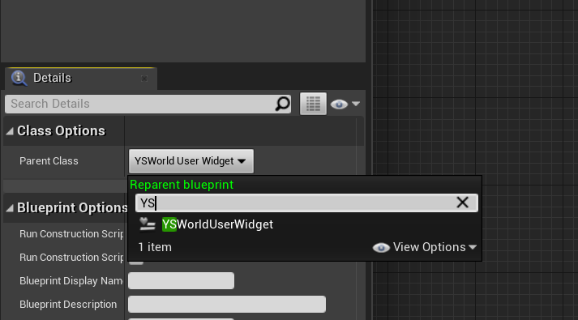
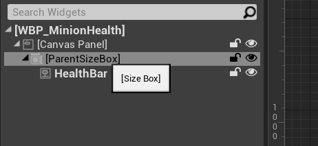

# UI

## 1. 创建基类

在项目中添加依赖([参考资料](https://docs.unrealengine.com/4.27/en-US/ProgrammingAndScripting/ProgrammingWithCPP/CPPTutorials/UMG/))

```C++
PublicDependencyModuleNames.AddRange(new string[]
{
    "Core", "CoreUObject", "Engine", "InputCore", "HeadMountedDisplay"
    "UMG"
});

PrivateDependencyModuleNames.AddRange(new string[] { "Slate", "SlateCore" });
```

```C++
UCLASS()
class ACTIONROGUELIKE_API UYSWorldUserWidget : public UUserWidget
{
    GENERATED_BODY()
protected:
    // 需要在蓝图中创建一个名字为"ParentSizeBox"的"USizeBox"控件来绑定
    UPROPERTY(meta=(BindWidget))
    USizeBox* ParentSizeBox;

public:
    UPROPERTY(BlueprintReadOnly, Category="AI")
    AActor* AttachedActor;

    UPROPERTY(EditAnywhere, Category="UI")
    FVector WorldOffset;


    // 检测目标Actor是否存在,不存在则将自身移除
    virtual void NativeTick(const FGeometry& MyGeometry, float InDeltaTime) override;
};


void UYSWorldUserWidget::NativeTick(const FGeometry& MyGeometry, float InDeltaTime)
{
    Super::NativeTick(MyGeometry, InDeltaTime);

    if (!IsValid(AttachedActor))
    {
        RemoveFromParent();
        UE_LOG(LogTemp, Warning, TEXT("Attached Actor no longer valid, removing Health Widget"));
        return;
    }

    FVector2D ScreenPosition;
    // 获取目标 Actor 对应的 3D 位置
    // 适合血条,伤害数字等
    if (UGameplayStatics::ProjectWorldToScreen(GetOwningPlayer(), AttachedActor->GetActorLocation() + WorldOffset,
                                               ScreenPosition))
    {
        float ViewportScale = UWidgetLayoutLibrary::GetViewportScale(this);
        ScreenPosition /= ViewportScale;

        if (ParentSizeBox)
        {
            ParentSizeBox->SetRenderTranslation(ScreenPosition);
        }
    }
}
```

## 2. 创建蓝图子类并绑定父类

在 `Graph` 中的 `Class Settings` 中选择父类



在 Designer 中创建对应控件(否则编译会报错)


